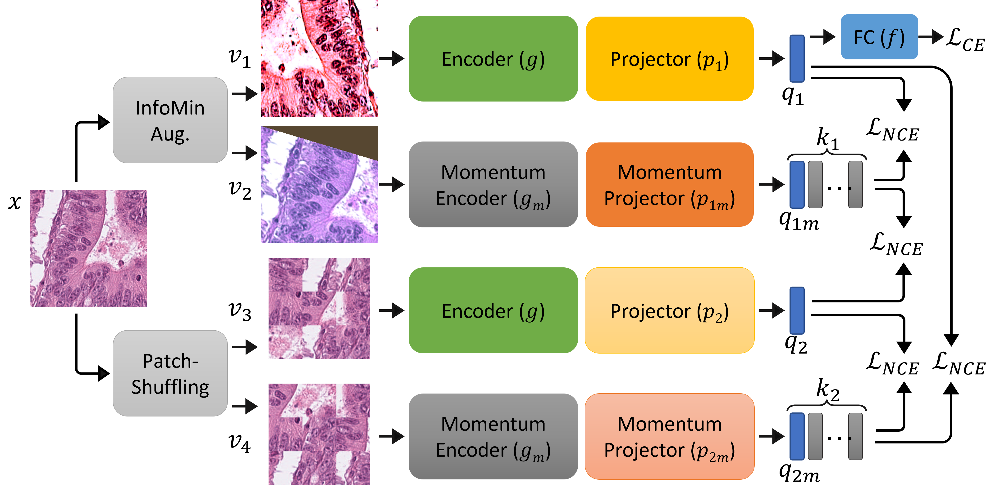

## IMPaSh

Implementation of paper [[arXiv]](https://arxiv.org/abs/2208.11052): 

"IMPaSh: A Novel Domain-shift Resistant Representation for Colorectal Cancer Tissue Classification"
by Trinh Thi Le Vuong, Quoc Dang Vu, Mostafa Jahanifar, Simon Graham, Jin Tae Kwak, and Nasir Rajpoot.

(Will be present at ECCV Workshop 2022)

Note: The clean version will be release later.
```

```
<p align="center">
  
</p>


## Snippet of PatchShuffling Module
```python
import numpy as np
from random import shuffle
from PIL import Image

class PatchShuffling(object):
    """
     PatchShuffling Module
    """
    def __init__(self, n_grid=3, img_size=255, crop_size=64):
        self.n_grid = n_grid
        self.img_size = img_size
        self.crop_size = crop_size
        self.grid_size = int(img_size / self.n_grid)
        self.side = self.grid_size - self.crop_size

        yy, xx = np.meshgrid(np.arange(n_grid), np.arange(n_grid))
        self.yy = np.reshape(yy * self.grid_size, (n_grid * n_grid,))
        self.xx = np.reshape(xx * self.grid_size, (n_grid * n_grid,))

        self.re_yy = np.reshape(yy * self.crop_size, (n_grid * n_grid,))
        self.re_xx = np.reshape(xx * self.crop_size, (n_grid * n_grid,))

    def __call__(self, img):
        r_x = np.random.randint(0, self.side + 1, self.n_grid * self.n_grid)
        r_y = np.random.randint(0, self.side + 1, self.n_grid * self.n_grid)
        img = np.asarray(img, np.uint8)
        crops = []
        for i in range(self.n_grid * self.n_grid):
            crops.append(img[self.xx[i] + r_x[i]: self.xx[i] + r_x[i] + self.crop_size,
                         self.yy[i] + r_y[i]: self.yy[i] + r_y[i] + self.crop_size, :])
        shuffle(crops)

        shuffling_img = np.zeros([self.crop_size*self.n_grid, self.crop_size*self.n_grid, 3], dtype='uint8')
        for i in range(self.n_grid * self.n_grid):
            shuffling_img[self.re_xx[i]: self.re_xx[i] + self.crop_size, self.re_yy[i]: self.re_yy[i] + self.crop_size] \
                = crops[i]

        return Image.fromarray(shuffling_img)
```

## Train the self-supervised encoder and Options
 
```
python main_contrast_Jig.py \
  --method IMPaShMoCo \
  --jigsaw_stitch\
  --cosine \
  --dataset_name  k19 \
  --multiprocessing-distributed --world-size 1 --rank 0 \
  --dist-url 'tcp://127.0.0.1:23458'
```


## Train the classifier and Options

```
python main_linear_9sra.py \
 --method PatchSMoco \
 --ckpt ./save/k19_IMPaSH/ckpt_epoch_200.pth\
 --aug_linear RA \
 --dataset_name  k19 \
 --keephead head \
 --multiprocessing-distributed --world-size 1 --rank 0 \
 --dist-url 'tcp://127.0.0.1:23458'

```

## Inference on target dataset

```
python main_infer.py \
 --method IMPaSH \
 --ckpt ./save/k19_IMPaSH/ckpt_epoch_200.pth\
 --ckpt_class ./save/k19_IMPaSH_linear_head_True/ckpt_epoch_40.pth\
 --dataset_name  k16 \
 --keephead head \
 --multiprocessing-distributed --world-size 1 --rank 0 \
 --dist-url 'tcp://127.0.0.1:23452'
```
